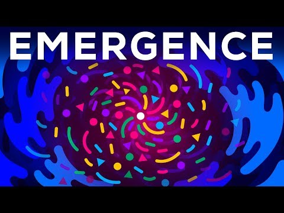
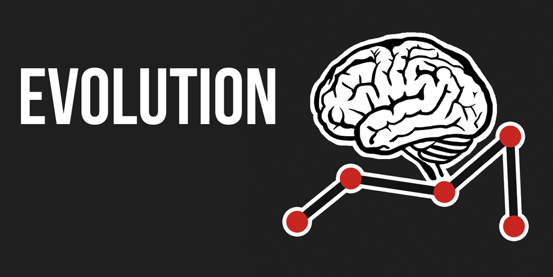
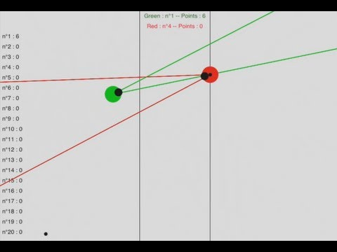
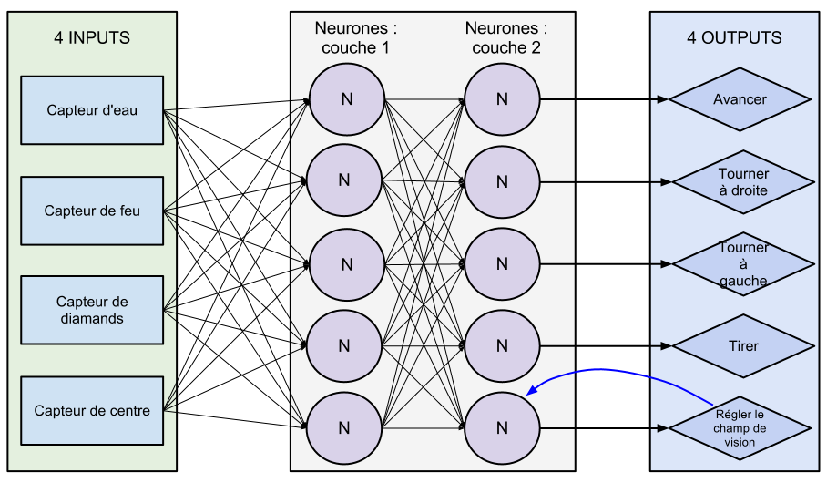
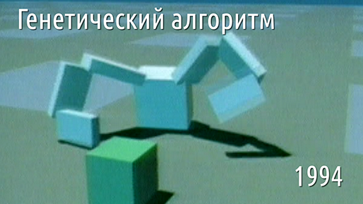
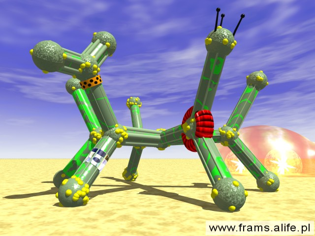
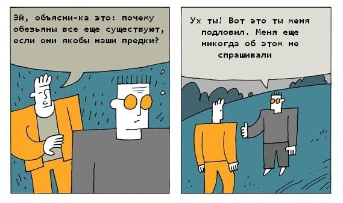
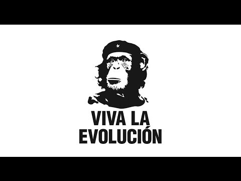

# О чём этот документ и чат

Данный документ систематизирует интересную информации по темам:
* Симуляция эволюции
* Искусственная жизнь
* Нейронные сети
* Клеточные автоматы
* Искусственный интеллект

**Цель:** расширить сознание, вдохновиться и написать свою симуляцию жизни, эволюции, или чего-то, исследование чего приближает нас к созданию General/Strong ИИ. Либо написать просто в образовательных целях.

Он построен по принципу репозиториев [4D](https://github.com/optozorax/4D) и [hyperbolic](https://github.com/optozorax/hyperbolic): имеется некоторый чат, где происходит обсуждение этих тем, и где скидываются интересные материалы, а затем они систематизируются в такой документ на GitHub.

**Чат:** [telegram:emergevolution](https://t.me/emergevolution)

Все заинтересованные приглашаются в чат, обсуждать эти темы, критиковать и совершенствовать этот документ.

**Как можно совершенствовать:**
* Предлагать новый материал
* Дополнять комментариями и анализом уже существующий (например анализировать статью, видео, программу). Видно, что здесь не везде хватает комментариев. Вы можете взять на себя эту работу, если вам интересно разобраться в чём-то.
* Создавать таблицы сравнения (для библиотек, для различных симуляций)

Так же существует два тренда в написании симуляций искусственной жизни: 
* С упором на индивидуальное сущесвтво, чтобы оно было как можно умнее
* С упором на экосистему, неважно тупое существо в итоге, главное чтобы взаимодействие множества из них было интересным

Этот чат больше об эволюции индивидуального существа. Это показывает [данный опрос](https://t.me/emergevolution/215).

Здесь практически все картинки кликабельные, и иногда они показывают что это является видео с ютуба, иногда ведут на сайт.

# Оглавление

[//]: # "start-toc"
   * [О чём этот документ и чат](#о-чём-этот-документ-и-чат)
   * [Оглавление](#оглавление)
   * [Что такое Эмерджеволюция?](#что-такое-эмерджеволюция)
      * [Этимология](#этимология)
      * [Проблематика](#проблематика)
   * [Искусственная жизнь, симуляция эволюции](#искусственная-жизнь-симуляция-эволюции)
      * [Таблица](#таблица)
      * [Без визуализации](#без-визуализации)
         * [Tierra](#tierra)
      * [2D](#2d)
         * [Слепой часовщик](#слепой-часовщик)
         * [Эволюция с мышцами](#эволюция-с-мышцами)
         * [Сражающиеся кружочки](#сражающиеся-кружочки)
         * [Машинки на произвольных нейронных сетях](#машинки-на-произвольных-нейронных-сетях)
         * [Learn 2D Stick](#learn-2d-stick)
         * [foo52ru](#foo52ru)
         * [Живые квадратные клетки](#живые-квадратные-клетки)
            * [Симуляция деревьев](#симуляция-деревьев)
            * [Эволюция змейки](#эволюция-змейки)
         * [SnakeAI](#snakeai)
            * [Проблемы змеек](#проблемы-змеек)
         * [Tallensy evolution](#tallensy-evolution)
         * [Амёбы](#амёбы)
         * [gencar.co](#gencarco)
         * [Cephalopods](#cephalopods)
            * [Идея развития](#идея-развития)
      * [3D](#3d)
         * [Работа Карла Симса](#работа-карла-симса)
         * [Flexible Muscle-Based Locomotion for Bipedal Creatures](#flexible-muscle-based-locomotion-for-bipedal-creatures)
         * [Онигири](#онигири)
         * [Framsticks](#framsticks)
         * [Polyworld](#polyworld)
   * [Про эволюцию в общем](#про-эволюцию-в-общем)
      * [Комикс](#комикс)
      * [Эволюция доверия](#эволюция-доверия)
      * [Видовое разнообразие в реальном мире](#видовое-разнообразие-в-реальном-мире)
      * [Почему у реальной эволюции получается так легко подстраиваться](#почему-у-реальной-эволюции-получается-так-легко-подстраиваться)
   * [Про искусственную жизнь в общем](#про-искусственную-жизнь-в-общем)
      * [Видео от ПостНауки](#видео-от-постнауки)
   * [Математическая основа](#математическая-основа)
      * [Производная, градиент](#производная-градиент)
      * [Методы оптимизации](#методы-оптимизации)
         * [Градиентный спуск](#градиентный-спуск)
         * [Всё это методы локального поиска](#всё-это-методы-локального-поиска)
      * [Что такое нейросеть](#что-такое-нейросеть)
      * [Нахождение производной и градиента численно.](#нахождение-производной-и-градиента-численно)
      * [Метод обратного распространения ошибки для нахождения градиента](#метод-обратного-распространения-ошибки-для-нахождения-градиента)
      * [Граф вычислений](#граф-вычислений)
      * [Шум](#шум)
      * [Другие методы оптимизации](#другие-методы-оптимизации)
         * [Ньютоновский метод](#ньютоновский-метод)
         * [Квазиньютоновские методы](#квазиньютоновские-методы)
         * [Баесовская оптимизация](#баесовская-оптимизация)
         * [CMA-ES](#cma-es)
         * [Генетический алгоритм](#генетический-алгоритм)
            * [Про генетический алгоритм](#про-генетический-алгоритм)
            * [Практика реализации генетических алгоритмов](#практика-реализации-генетических-алгоритмов)
         * [Когда скрещивание оправдано, а когда нет](#когда-скрещивание-оправдано-а-когда-нет)
         * [Естественный отбор](#естественный-отбор)
      * [Дифференцируемое](#дифференцируемое)
         * [Физика](#физика)
         * [Рей-трейсинг](#рей-трейсинг)
         * [Программирование](#программирование)
   * [Нейронные сети](#нейронные-сети)
      * [Общая информация](#общая-информация)
      * [WANN](#wann)
      * [Атака на нейросеть](#атака-на-нейросеть)
      * [Управление существом](#управление-существом)
      * [Произвольная нейросеть](#произвольная-нейросеть)
   * [ИИ](#ии)
      * [Труд Алана Тьюринга](#труд-алана-тьюринга)
      * [Китайская комната](#китайская-комната)
      * [Автоматы и жизнь - Колмогоров](#автоматы-и-жизнь---колмогоров)
      * [Критика AlphaStar](#критика-alphastar)
      * [Критика глубокого обучения](#критика-глубокого-обучения)
   * [Клеточные автоматы](#клеточные-автоматы)
      * [Автомат, восстанавливающийся в картинку](#автомат-восстанавливающийся-в-картинку)
      * [Автомат фон Неймана](#автомат-фон-неймана)
      * [Обратимый клеточный автомат](#обратимый-клеточный-автомат)
      * [Клеточный автомат, копирующий картинку](#клеточный-автомат-копирующий-картинку)
   * [Написание собственной симуляции](#написание-собственной-симуляции)
      * [Что нужно учесть](#что-нужно-учесть)
         * [Симулировать и рисовать отдельно](#симулировать-и-рисовать-отдельно)
         * [Задание поведения существа программой](#задание-поведения-существа-программой)
         * [Книга про эволюцию и нейросети](#книга-про-эволюцию-и-нейросети)
      * [Платформы, библиотеки](#платформы-библиотеки)
         * [spiril](#spiril)
   * [Идеи](#идеи)
      * [Для реализации](#для-реализации)
         * [Цепляться за 2D пространство](#цепляться-за-2d-пространство)
         * [Обучение нейросетей блоками](#обучение-нейросетей-блоками)
         * [Типизация для генов-программ](#типизация-для-генов-программ)
      * [Абстрактные](#абстрактные)
         * [Жизнь без страданий](#жизнь-без-страданий)
   * [Приколы](#приколы)
      * [Мемы](#мемы)
      * [Приколы из симуляции эволюции](#приколы-из-симуляции-эволюции)
      * [Профессиональная деформация Data Scientist'ов](#профессиональная-деформация-data-scientistов)
      * [Хаки эволюции в реальном мире](#хаки-эволюции-в-реальном-мире)
      * [Сильный ИИ никогда не будет создан](#сильный-ии-никогда-не-будет-создан)
   * [Полезные ресурсы для улучшения документа](#полезные-ресурсы-для-улучшения-документа)

[//]: # "end-toc"

# Что такое Эмерджеволюция?

## Этимология

Слово придумал `optozorax`, образовав его от двух слов: эмерджентность и эволюция. Про слово эмерджентность он впервые узнал в этом видео:

[](http://www.youtube.com/watch?v=16W7c0mb-rE "")

_Википедия говорит:_ **Эмерджентность** в теории систем — появление у системы свойств, не присущих её элементам в отдельности; несводимость свойств системы к сумме свойств её компонентов.

## Проблематика

Все известные автору симуляции эволюции обладают таким свойством, что они сходятся к какому-то одному решению, и не могут бесконечно расти в сложности и разнообразности проявлений, по аналогии с тем, как это происходит в реальной жизни и природе на Земле.

И это очень прискорбно, ведь, даже обладая огромными мощностями, мы не можем просто запустить какую-то программу по симуляции эволюции, подождать пару лет и получить очень интересные результаты, потому что неизвестно о существовании таких программ.

Поэтому автора волнует проблема получения такой симуляции эволюции, которая сможет расти потенциально бесконечно и постоянно усложняя своих существ.

И такую бесконечно растущую эволюцию он и назвал **эмерджеволюцией**.

Хочется её создать как минимум для того чтобы исследовать и смотреть что получается, в потенциале это может помочь понять нашу собственную эволюцию и развитие интеллекта.

Далее примеры как разные авторы определяют это по своему:

---

Этот термин давно придумали до автора данного документа, есть даже страница на английской Википедии: [Emergent evolution](https://en.wikipedia.org/wiki/Emergent_evolution). Только они описывают это не как один из типов эволюции, а как гипотезу о возникновении разума.

---

В [видео от ПостНауки](#видео-от-постнауки) было сказано:

> Несмотря на то что искусственная жизнь достигла таких успехов за это время, всё-равно главная проблема, которая перед ней стояла, остаётся неразрешённой: проблема того как сложность организмов может нарастать в процессе эволюции.

---

Так же это ещё называется **Open Ended Evolution**. Вероятно по этому названию можно искать научные статьи и публиковать самому.

На [сайте evolvingai.org](https://web.archive.org/web/20190724143915/http://www.evolvingai.org/content/open-ended-evolution) они определяют этот термин как:

> Creating computational evolutionary processes that--like natural evolution--endlessly produce a diversity of complex, interesting things.

---

На 17 минуте видео о программе [Tierra](#tierra), её автор говорит что он тоже хочет создать эволюцию, которая бесконечно усложняется.

# Искусственная жизнь, симуляция эволюции

## Таблица

**Турбо** - означает что симуляцию можно запустить без визуализации, и она не будет ограничена возможностями обновления экрана и на рисование картинки не будут тратиться ресурсы. Про эту проблему можно почитать [здесь](#симулировать-и-рисовать-отдельно).

|                                                        | Визуализация | Метод оптимизации          | Задача                              | Видео | Исходный код | Исполняемый файл | Мозги              | Турбо | Основа существ                |
|--------------------------------------------------------|--------------|----------------------------|-------------------------------------|-------|--------------|------------------|--------------------|-------|-------------------------------|
| Tierra                                                 | -            | Естественный отбор         | Выжить                              | +     | +            | +                | Программа          | ?     | ОЗУ                           |
| Слепой часовщик                                        | 2D           | Генетический алгоритм      | Показывать время                    | +     | +            | -                | -                  | -     | Часы                          |
| Эволюция с мышцами                                     | 2D           | Генетический алгоритм      | Идти, прыгать                       | +     | +            | web              | Нейросеть          | -     | Прямоугольники на шарнирах    |
| Сражающиеся кружочки                                   | 2D           | Генетический алгоритм      | Победить противника                 | +     | -            | -                | Нейросеть          | -     | Круги с пулями                |
| Машинки на произвольных нейросетях                     | 2D           | Эволюционный алгоритм      | Проехать трассу                     | +     | -            | -                | Нейросеть          | -     | Машинки                       |
| Learn 2D Stick                                         | 2D           | Генетический алгоритм      | Ходить, прыгать                     | +     | -            | +                | Нейросеть          | +     | Прямоугольники на шарнирах    |
| foo52ru боты                                           | 2D           | Естественный отбор         | Выжить                              | +     | +            | -                | Программа          | -     | Квадратные клетки             |
| foo52ru деревья                                        | 2D           | Естественный отбор         | Выжить                              | +     | +            | -                | -                  | -     | Квадратные клетки             |
| foo52ru змейки                                         | 2D           | Ручной, Естественный отбор | Выжить, выиграть                    | +     | +            | -                | Нейросеть          | -     | Квадратные клетки             |
| SnakeAI                                                | 2D           | Генетический алгоритм      | Выиграть                            | +     | +            | -                | Нейросеть          |       | Квадратные клетки             |
| Tallensy evolution                                     | 2D           | Генетический алгоритм      | Проехать трассу                     | -     | -            | +                | -                  | -     | Шестиугольники с колёсами     |
| Амёбы                                                  | 2D           | Генетический алгоритм      | Победить противника                 | -     | -            | +                | Программа с генами | +     | Амёбы                         |
| gencar.co                                              | 2D           | Генетический алгоритм      | Проехать трассу                     | -     | +            | web              | -                  | +     | Машинки с изменяемым телом    |
| Cephalopods                                            | 2D           | Генетический алгоритм      | Съесть больше еды                   | -     | +            | web              | Spiking нейросеть  | +     | Осьминогоподобные             |
| Evolved Virtual Creatures                              | 3D           | Генетический алгоритм      | Ходить, прыгать, сражаться, плавать | +     | -            | -                | Skiping нейросеть  | -     | Прямоугольники на шарнирах 3D |
| Flexible Muscle-Based Locomotion for Bipedal Creatures | 3D           | CMA-ES                     | Ходить                              | +     | -            | -                | ?                  | -     | Прямоугольники с мышцами      |
| Онигири                                                | 3D           | Генетический алгоритм      | Ходить                              | +     | +            | -                | Нейросеть          | ?     | Прямоугольники на шарнирах    |
| Framsticks                                             | 3D           | ?                          |                                     | ?     | ?            | ?                | ?                  | ?     | ?                             |
| Polyworld                                              | 3D           | Естественный отбор         | Выжить                              | +     | +            | -                | Нейросеть          | ?     | Прямоугольники на шарнирах    |

## Без визуализации

### Tierra

[](http://www.youtube.com/watch?v=Wl5rRGVD0QI "")

[Tierra](https://en.wikipedia.org/wiki/Tierra_%28computer_simulation%29) - одна из самых первых симуляций искусственной жизни, в которой возникли паразиты и сложные формы.

[Страница проекта.](http://life.ou.edu/tierra/)

[Документ](https://t.me/emergevolution/924) об этой программе на 244 страницы.

[Исполняемый файл](https://t.me/emergevolution/925) для Windows. Для других платформ (и исходный код) есть на официальном сайте. Это просто копия.

Как работает программа: есть операционная система, которая определяет:
* Работу с памятью
* Выделение времени на вычисления каждому существу
* Подсчёт смертей и рождений
* Банк успешных геномов
* Автоматизирует экологический анализ

А программами этой операционной системы являются существа.

```
TODO понять как это работает, потому что это какая-то очень жёсткая работа, ставшая началом многому
```

## 2D

### Слепой часовщик

[](https://www.youtube.com/watch?v=dN_6B1auRV4)

Видео, сделанное изначально как камень в огород верующих, но нас оно интересует симуляцией эволюции. Здесь примечательно то что эта симуляция отличается от всех своей основой. Так же очень хорошо показаны графики развития различных типов существ.

К сожалению здесь много чего мутного:
* Не понятны критерии отбора
* Мало чего объясняется
* Исходный код вообще написан на матлабе

### Эволюция с мышцами



Запустить можно на [официальном сайте](https://keiwan.itch.io/evolution).

**Как управляется существо:** нейросетью с полносвязными слоями. Числом слоёв можно управлять.

**Входные параметры:**
  * Расстояние от земли до существа
  * Текущая скорость
  * Угловая скорость
  * Количество точек, касающихся земли
  * Средний угол вращения всех частей тела
  * Глаз, видящий расстояния одним лучом

**Выходные параметры:**
  * Управление каждым мускулом, значение от -1 до 1
  * Изменение направления глаза

**Способ обучения:** генетический алгоритм

**Имеется режим быстрой перемотки:** нет.

**Форму существа можно модифицировать:** да.

**Вдохновлено Карлом Симсом:** да.

[](https://twitter.com/enormepuissance/status/1256978403619745792)

### Сражающиеся кружочки

[](https://www.youtube.com/watch?v=u2t77mQmJiY)

Всё понятно из видео (русских субтитров нету, учите английский!). Вот что не сказано в видео, а сказано на официальном сайте этого проекта, переведя французский через гугл-переводчик:

Система классификации и, следовательно, соответствующий расчет - это система турниров (каждый сталкивается со всеми остальными), где каждый игрок выигрывает 3 очка за выигранный матч, 1 за ничью и 0 в случае проигрыша.

Используемый алгоритм выбора - это «колесо рулетки».

**Как управляется существо:** нейросетью с 2 полносвязными слоями. Числом слоёв можно управлять.

**Входные параметры:**
  * Присутствие врага в поле его зрения
  * Присутствие пушечного ядра в его поле зрения
  * Если он уже выпустил ракету или нет
  * Ширина (в радианах) его поля зрения

**Выходные параметры:**
  - Идти прямо
  - Повернуть налево
  - Повернуть направо
  - Стрелять
  - Изменить поле зрения

**Способ обучения:** генетический алгоритм



### Машинки на произвольных нейронных сетях


[Видео.](http://www.youtube.com/watch?v=5lJuEW-5vr8)

Здесь прямо на видео показывается текущая нейросеть машинки, видно что входами являются расстояния от глаз, а выходами - скорость движения и угол поворота.

При этом можно заметить, что нейросеть не является привычным перцептроном, а имеет какую-то произвольную структуру, где, вроде, образуются циклы.

В итоге машинки идеально обучаются управлять собой.

Про "произвольную нейросеть" есть [статья](#произвольная-нейросеть).

### Learn 2D Stick


Здесь представлены существа из линий с мышцами, которые обучаются ходить, прыгать итд. 

**Как управляется существо:** нейросетью.

**Способ обучения:** генетический алгоритм

**Имеется режим быстрой перемотки:** да.

**Форму существа можно модифицировать:** да.

Программа имеет богатый интерфейс и кучу настроек, пожалуй самая продвинутая из всех здесь представленных. Вот видео, которое способна генерировать эта программа.

[](http://www.youtube.com/watch?v=xcIBoPuNIiw "")

Её можно скачать [здесь](https://miorsoft.github.io/Site/index.html).

### foo52ru

**foo52ru** - это никнейм автора в данной секции.

Данного автора от других отличают такие качества как самостоятельность и оригинальные идеи. Обычно другие воруют у других идеи, используют нейросети там где они не нужны, а данный автор придумывает необычные идеи сам. У него интересный олдскульный стиль.

Этот автор больше интересуется искусственной жизнью на основе квадратных клеток именно как жизнью, у которой могут быть интересные существа, занимающие разные ниши. 

Он создал группу [Кибербиология](https://vk.com/cyberbiology), где люди публикуют свои работы, и есть чат единомышленников.

### Живые квадратные клетки

Его первая и главная работа:

[](http://www.youtube.com/watch?v=SfEZSyvbj2w "")

В видео выше не происходит прямого программирования алгоритма эволюции или генетического алгоритма, а он возникает автоматически за счёт среды. Это называется "естественный отбор". 

Он использует квадратных "ботов" с программой в виде чисел для программирования поведения. Ботам необходимо собирать еду и выживать рядом друг с другом и под действием жестокой среды. 

Есть продолжения данной жизни:

[](http://www.youtube.com/watch?v=PCx228KcOow "")

[](http://www.youtube.com/watch?v=jXa5IASmlkg "")

[](http://www.youtube.com/watch?v=yCwttjIkxLs "")

#### Симуляция деревьев

В последнее время он занимается симуляцией жизни на основе деревьев.

[](http://www.youtube.com/watch?v=WTh-gNZxTM8 "")

[](http://www.youtube.com/watch?v=vv7R1J-qe1c "")

[](http://www.youtube.com/watch?v=ZhcsoK91tyI "")

#### Эволюция змейки

[](http://www.youtube.com/watch?v=dXcIf5YwaUQ "")

[](http://www.youtube.com/watch?v=P9w7nFLEAhg "")

[](http://www.youtube.com/watch?v=n-KDlkv__B8 "")

### SnakeAI

[](http://www.youtube.com/watch?v=zIkBYwdkuTk "")

Автор обучает нейронную сеть играть в змейку. На вход подаются сигналы от зрения: расстояние до еды, стены, собственного тела; итого 24 входа. На выход просто в какую сторону двигаться.

Нейросеть является обычным полносвязным перцептроном.

Обучается генетическим алгоритмом.

Исходный код и всё то же самое в текстовом формате написано в репозитории: [github.com/greerviau/SnakeAI](https://github.com/greerviau/SnakeAI).

#### Проблемы змеек

Проблема практически всех реализаций эволюции змейки в том что змейка не может помнить куда она ходила до этого и какую форму своего тела выстроила. А значит она выстаивает своё тело либо чтобы как можно быстрее прийти к еде, либо по одному паттерну. Но она вряд ли сможет выстраивать своё тело достаточно разумно, когда поглотит слишком много еды, и её тело будет занимать 90% поля. Увидеть как должна играть змейка в идеале можно здесь:

[](http://www.youtube.com/watch?v=kZr8sR9Gwag "")

Простая нейросеть без памяти не способна победить таким образом.

Одним из способов решить такую проблему является подавание на вход намного больше числа состояний, например, больший объём поля. Так нейросеть сможет выучить сложные паттерны которые она сама формирует и как надо с ними поступать. Например, так сделано у [foo52ru](#эволюция-змейки).

Другой способ - напрямую дать возможность нейросети запоминать или продумывать шаги в уме, или Monte-Carlo Tree Search, но такого пока никто не делал.

### Tallensy evolution

[Tallensy evolution](https://t.me/emergevolution/231) для Android, ещё [версия 2.0](https://t.me/emergevolution/237). Не работает на новых версиях Андроида. Здесь эволюционируют машинки, состоящие из шестиугольников и колёс, разные цвета шестиугольников имеют разные функции. Эволюционирует только форма, мозг у машинок отсутствует, они всегда едут вперёд. Задача эволюции: собрать такую машинку, которая на данной извилистой дороге проедет дальше всех. Дорога очень маленькая, так что они быстро делают нормальную машинку.

Виды шестигоульников:
* Зелёные генерируют энергию
* Белые хранят лишнюю энергию
* Фиолетовые подталкивают машинку, когда она застряла
* Зелёные дают скорости


### Амёбы

```
TODO
```

### gencar.co

```
TODO рассказать
```

### Cephalopods

[](https://jobtalle.com/Cephalopods/)

[Статья](https://jobtalle.com/neuroevolution_in_squids.html) об этом.

Задача существ: просто двигаться максимально быстро вперёд. 

К сожалению в этой симуляции у существ нет никаких сенсоров, они ничего не чувствуют. Поэтому вначале нельзя делать ни малейшей ошибки, чтобы идти идеально вперёд, ведь потом существо не сможет скорректировать свою тракеторию и понять что оно сошло с пути.

#### Идея развития

Есть пара идей как это можно развивать:
* Добавить им возможность чувствовать плотность частиц вокруг. Причём чем ближе, тем сильнее плотность.
* Аналогично чувство плотности окружающих врагов
* Плотность работает на 360 градусов. Можно под неё выделить 36 нейронов, например

И дать им время находиться на поле подольше, чтобы суметь скушать эти частицы, и учитывать куда ходят враги, чтобы собрать как можно больше

И потом потестировать это на разных полях: 
* как на этом сайте, где один центр поля
* где есть несколько центров
* где всё разбросано равномерно

Или можно сделать две окружности ощущения плотности на разных расстояниях, подавать это существу, и чтобы оно научилось определять расстояние до объектов по этому. Затем подключаем отдельную нейросеть, которая двигается в указанном направлении, визуализируем это направление и видим высокоуровнево чего хочет нейросеть!

## 3D

### Работа Карла Симса

[](https://www.youtube.com/watch?v=2ZJijzzJzWU)

Шедевральная работа, сделанная в 1994 году! `optozorax` делал обзор на эту работу, где можно найти ссылки на оригиналы, и множество идей по улучшению:

[Эволюция виртуальных существ](https://optozorax.github.io/evolved-virtual-creatures)

**MUST READ!**

### Flexible Muscle-Based Locomotion for Bipedal Creatures

[](http://www.youtube.com/watch?v=pgaEE27nsQw "")

Классика. Здесь при помощи эволюционного алгоритма находится такое управление мышцами для этих сложных существ, чтобы они красиво и стабильно ходили. Для поиска оптимального решения используется алгоритм CMA-ES.

Данная работа очень интересна тем, что они используют множество мышц, и их существа двигаются очень реалистично. Можно попробовать прочитать их работу и использовать это для своей симуляции искусственной жизни.

Именно отсюда пришёл тот самый мем, где в идущего человека кинули большой куб:


[Научная работа](https://www.goatstream.com/research/papers/SA2013/SA2013.pdf), где всё это описывается более подробно. Они использовали алгоритм [CMA-ES](#cma-es), который обещает быть очень крутым.

### Онигири

Онигири - это автор видео на ютубе. В данных видео он обучает существ, состоящих из прямоугольников, даёт им задачи двигаться вперёд. Для существ использует нейросети.

Интересно то, что у него эволюция стала идти лучше, когда он добавил скрещивание.

[](http://www.youtube.com/watch?v=JaPwn-pvHTs "")

[](http://www.youtube.com/watch?v=v5f6fz3a9Ho "")

### Framsticks

[](http://www.framsticks.com/)

```
TODO изучить
```

### Polyworld

[](http://www.youtube.com/watch?v=_m97_kL4ox0 "")

Существа, аналогичные тому какие были в видео Карла Симса. Их засунули в одно место, чтобы они пытались выжить. То есть оставили развитие на естественный отбор. Вдохновлялись работой Карла Симса.

Здесь по идее существа должны придумывать сложное поведение. Результаты печальные: никакого сложного поведения не возникало, сложность мозга в итоге сошлась к какому-то пределу, и в самом видео автор серьезно поднимает эту тему.

# Про эволюцию в общем

## Комикс

[](img/eye-evolution.jpeg)

Довольно простой, но большой комикс, где хорошо рассказывают про то как потенциально мог возникнуть глаз и уже замеченные подтверждения эволюции.

**MUST READ!**

## Эволюция доверия

Игра, показывающая как развивается доверие между людьми, много используется визуализация этого процесса, и объясняется на примере теории игр.

[](https://notdotteam.github.io/trust/)

## Видовое разнообразие в реальном мире

[Цитата от участника чата:](https://t.me/emergevolution/340)

> Даже на практике у людей, которые сами разводят кормовые культуры (тараканы, сверчки) для домашних животных, они через поколения становятся слабыми, если не «подмешивать кровь» из других популяций

Статья о [эффекте бутылочного горлышка](https://ru.m.wikipedia.org/wiki/%D0%AD%D1%84%D1%84%D0%B5%D0%BA%D1%82_%D0%B1%D1%83%D1%82%D1%8B%D0%BB%D0%BE%D1%87%D0%BD%D0%BE%D0%B3%D0%BE_%D0%B3%D0%BE%D1%80%D0%BB%D1%8B%D1%88%D0%BA%D0%B0).

Интересно понять почему у нас в программах видовое разнообразие не играет такую роль, какую оно играет в эволюции живности на нашей планете. Видимо главная проблема реальности в том, что там куча разных генов, и от их разнообразия зависит адаптируемость вида. А в компьютерных программах у нас обычно один большой ген, и сокращение его численности до 1% самых лучших никак не сказывается на общем итоге.

Так же интересно понять как надо написать симуляцию эволюции, чтобы в ней разнообразие генов давало буст к выживаемости.

## Почему у реальной эволюции получается так легко подстраиваться

[](https://habr.com/ru/post/370321/)

Краткая суть статьи: эволюция в реальном мире делает своих существ избыточными, у них слишком много всего "лишнего", что позволяет быстро адаптироваться к изменяющимся условиям.

# Про искусственную жизнь в общем

## Видео от ПостНауки

[](http://www.youtube.com/watch?v=tGNDQvNND2c "")

В этом видео он упомянул две интересные вещи:
1. [Клеточный автомат фон Неймана](#автомат-фон-неймана), который умеет самореплицироваться (?).
2. [Tierra](#tierra) - программа по захвату оперативной памяти, в которой появились паразиты и сложные штуки. Сделана в 90-х годах.

# Математическая основа

**Дисклеймер:** я объясняю это своими словами и как сам понимаю, не стараясь написать это максимально формально и корректно, поэтому где-то будут допущения, а где-то упрощения. Хотите корректную информацию - читайте книги. А далее будет написана информация только для ознакомления и формирования первичных ассоциаций. P.S. ДАННАЯ ИНФОРМАЦИЯ ПРЕДОСТАВЛЯЕТСЯ "КАК ЕСТЬ" И ЕЁ АВТОР НЕ НЕСЁТ ЗА НЕЁ НИКАКОЙ ОТВЕТСТВЕННОСТИ :D

## Производная, градиент

**Производная от функции** - операция над функцией, которая возвращает новую функцию; новая функция показывает как сильно изменяется результат функции в зависимости от изменения заданной переменной. Дальше смотри [Википедию](https://ru.wikipedia.org/wiki/%D0%9F%D1%80%D0%BE%D0%B8%D0%B7%D0%B2%D0%BE%D0%B4%D0%BD%D0%B0%D1%8F_%D1%84%D1%83%D0%BD%D0%BA%D1%86%D0%B8%D0%B8).

Производную можно взять только по функции, которая возвращает вещественное число (ну или комплексное итд, но не дискретное, не натуральное). Так же производную можно брать по различным переменным функции, причём только по тем, которые являются вещественными числами. Это называется [частной производной](https://ru.wikipedia.org/wiki/%D0%A7%D0%B0%D1%81%D1%82%D0%BD%D0%B0%D1%8F_%D0%BF%D1%80%D0%BE%D0%B8%D0%B7%D0%B2%D0%BE%D0%B4%D0%BD%D0%B0%D1%8F).
й
Скажем, у нас есть функция: `run_simulation(alpha, beta, genome) -> score`. Она показывает сколько очков заработает существо с параметрами-вещественными-числами: `alpha`, `beta`; и не вещественным числом, а набором битов `genome`. `genome` задаёт какую-то дискретную структуру существа, например, число слоёв, число нейронов в каждом слое, и всё это располагается по битам, например. Возвращает эта функция одно вещественное число - количество очков приспособлеснности к миру. Чем больше это число, тем лучше.

Попробуем взять частную производную функции `run_simulation` по переменной `alpha`, и так как она является вещественным числом, это можно сделать. Получаем функцию `run_simulation_d_alpha(alpha, beta, genome) -> dscore`. Эта функция показывает как сильно будет изменяться количество очков для разных значений `alpha` и фиксированных параметров `beta`, `genome`. 

**Градиент** - почти то же самое что и производная, только он является вектором производных по всем возможным переменным. То есть новая функция возвращает не одно число, а сразу несколько, для каждого параметра: `run_simulation_gradient(alpha, beta, genome) -> (d_alpha_score, d_beta_score)`. То есть берём производную по всем параметрам сразу.

Градиент является вектором, который показывает место в направлении которого функция возрастает.

Я не вдавался в такие подробности как частная производная и различные координаты, матрицы Якоби, просто для сохранения простоты. Надеюсь вы сами это всё пройдёте когда будете обучаться в университете.

Градиенты очень активно используются в куче методов оптимизации (соответственно в нейросетях), поэтому я начал с них.

## Методы оптимизации

**Метод оптимизации** - это метод, который для данной функции, возвращающей одно число, находит минимум/максимум. Далее будем говорить что метод оптимизации всегда ищет минимум, потому что искать максимум через минимум можно просто добавив к функции минус.

То есть этот метод принимает функцию, которая возвращает одно вещественное число, и находит параметры для которых это возвращаемое число является минимумом.

Процесс поиска минимума называется оптимизацией.

Пример с нашей функцией `run_simulation`, метод оптимизации найдёт такие параметры, при которых очки достигают максимального значения. А параметры этой функции являются геномом существа. Соответственно благодаря этому методу мы найдём существо, которое лучше всего решает нужную нам задачу в симуляции.

Обычно все методы оптимизации работают с функциями, которые принимают вещественные числа и возвращают вещественные числа. То есть найти оптимальный `genome` в функции `run_simulation` не очень получится (но есть маленькое "но", о котором [потом](#генетический-алгоритм)).

Так же очень часто методы оптимизации требуют расчёта градиентов, из-за чего я и начал о них говорить. Существуют методы оптимизации без градиентов, но это отдельная тема и о ней позже.

[Обзор методов оптимизаций с визуализациями (!)](http://fa.bianp.net/teaching/2018/COMP-652/).

То же самое [я пытался расписать и в чате](https://t.me/emergevolution/269).

### Градиентный спуск

Данный метод работает уже с функцией многих переменных. Наверняка вы слышали что нейросети обучают именно этим методом. 

Данному методу нужно только знать начальную точку и способ вычисления градиента, и он найдёт минимум гладкой функции.

На [Википедии](https://ru.wikipedia.org/wiki/%D0%93%D1%80%D0%B0%D0%B4%D0%B8%D0%B5%D0%BD%D1%82%D0%BD%D1%8B%D0%B9_%D1%81%D0%BF%D1%83%D1%81%D0%BA) отличные иллюстрации.

Ещё раз, градиентный спуск - это не какая-то составная часть нейросетей, это просто метод оптимизации, который хорошо подходит по производительности. На самом деле нейросети можно оптимизировать чем угодно: генетическим алгоритмом, многомерным методом ньютона, случайным перебором - всем, что позволяет находить минимум. Но именно градиентный спуск подходит лучше всего с практической точки зрения.

### Всё это методы локального поиска

Есть два рода методов оптимизации: **локальные** и **глобальные**. Локальный метод находит разные минимумы в зависимости от начальной точки и удачи. Он не обязательно найдёт самый маленький минимум, потому что у него просто не будет информации о горках, так как он очень ограничен в своих вычислениях.

Глобальный метод оптимизации способен находить **все** минимумы, и среди них выбирать самый минимальный. Но это экзотика в общем случае, так что не надейтесь что когда-нибудь изобретут применимый на практике метод глобальной оптимизации.

Практически все методы оптимизации нацелены на поиск локальных минимумов. Если вы хотите найти все возможные минимумы и изобрести глобальный метод оптимизации, то <s>не стоит вскрывать эту тему</s>. Во-первых потому что обычно должно хватать локальных минимумов, а во-вторых, потому что вы можете потратить слишком много сил на поиск всех минимумов, а получить лишь прирост на 10%, относительно локального, например.

## Что такое нейросеть

У некоторых есть такой стереотип что современные нейросети успешны именно благодаря тому что они берут идеи своей структуры из мозга живых существ. На самом деле нет. Почитайте, например, статью о [перцептроне](https://ru.wikipedia.org/wiki/Перцептрон), который является базой всех современных нейросетей. Похоже это хоть гипотетически на то что происходит в мозгу? Конечно нет, тут нету циклов, нету элементов запоминания, это просто... что-то очень линейное.

На самом деле перцептрон сводится математически к умножению матрицы на вектор и применении функции активации к вектору. То есть нейросети - это больше про матрицы, а не про отдельные функционирующие элементы-нейроны.

Если не знаете что такое матрицы, то считайте что умножение матрицы на вектор - это просто способ записать одновременно много умножений и сложений параллельно.

И нейросеть даёт возможность легко записать _аппроксимацию_ некоторой функции при помощи чисел. Например, у вас есть сложная функция `sin(x * ln(cos(x) + 2))`, и вы хотите аппроксимировать её на участке `[-1, 1]`, зная только её значения. Так вот, с помощью нейросети вы обязательно найдёте какие-то числа, которые будут аппроксимировать эту функцию с ошибкой 0.0001 (любое ваше число). То есть **нейросеть** - это способ задания функции через числа.

Тогда что такое нейросеть, которая получает картинку и возвращает кто изображён на этой картинке: собака или кошка? Это аппроксимация настоящей функции (оракула), которая всегда правильно определяет что есть собака а что есть кошка. То есть мы не знаем внутреннего устройства функции оракула (и никогда не узнаем), но мы можем её аппроксимировать, просто беря входы и выходы.

С другой стороны можно считать что мы не аппроксимируем некоторую несуществующую функцию по её входам и выходам, а просто минимизируем функцию потерь, и благодаря большому числу степеней свободы нейросети у нас это хорошо получается. В итоге нейросеть работает достаточно хорошо для практических целей.

На самом деле можно задавать функции через числа ещё миллионом способов, но перемножение матриц кажется самым простым и оптимальным.

Ещё одна важная мысль, что современный успех нейросетей - это опять не успех самих нейросетей и что они берут свою структуру из мозга живых существ, а это успех методов оптимизации и методов автоматического дифференцирования, о котором будет сказано далее.

Вот посмотрите на эти перемножения матриц и нахождение минимума функции при помощи взятия градиента. Где здесь биология? Где здесь те процессы, что на самом деле происходят в мозгу живых существ? Нету этого, машинное обучение и "нейросети" это уже давно далёкая от биологии часть.

И вообще мне кажется мы должны перестать всё это "нейросетями" и объяснять что нейросеть состоит из нейронов, которые посылают сигналы дальше, потому что такая популяризация ставит неправильный акцент, запутывая рядового пользователя.

## Нахождение производной и градиента численно.

В школе вы проходили как брать производную для функции, аналитическая запись которой вам известна, например: `f(x) = sin(x) * cos(x^2)`, а `f'(x) = cos(x) * cos(x^2) - 2 * x * sin(x) * sin(x^2)`.

Но как брать производную для функции, где вы не знаете такую запись, либо такое записать невозможно? Численная производная! Она считается по определению:

`f'(x) ≈ (f(x+0.00001) - f(x))/0.00001`

Где `0.00001` можно заменить на любое другое число, в зависимости от ваших потребностей.

Соответственно, чтобы приблизительно вычислить производную, надо вычислить саму функцию 2 раза: в исходной точке, и в точке, смещённой на константу.

Для нашей функции `run_simulation` это будет означать что нам надо запустить симуляцию два раза! 

Окей, а если мы хотим посчитать градиент? Ну тоже самое, только для каждой переменной. Получается, если мы хотим численно вычислить градиент функции с `N` параметрами, то нам придётся вычислить функцию `N+1` раз для разных параметров.

Чувствуете запах подгоревшего процессора? Теперь представьте, что у нас нейросеть с 400 параметрами, и этой нейросетью вы определяете на картинке кошку или собаку, и нейросеть оптимизируется для того чтобы лучше их различать. Тогда нам чтобы получить градиент придётся запустить вычисление нейеросети на каждой картинке 401 раз! Это очень плохо.

## Метод обратного распространения ошибки для нахождения градиента

Собственно, просмотрите [Википедию](https://ru.wikipedia.org/wiki/%D0%9C%D0%B5%D1%82%D0%BE%D0%B4_%D0%BE%D0%B1%D1%80%D0%B0%D1%82%D0%BD%D0%BE%D0%B3%D0%BE_%D1%80%D0%B0%D1%81%D0%BF%D1%80%D0%BE%D1%81%D1%82%D1%80%D0%B0%D0%BD%D0%B5%D0%BD%D0%B8%D1%8F_%D0%BE%D1%88%D0%B8%D0%B1%D0%BA%D0%B8).

Это метод, который для нейросетей позволяет вычислить градиенты по всем переменным, вычисляя нейросеть всего-лишь один раз! Конечно, там сложный метод, и надо записывать кучу информации, но всё-равно вычисление нейросети запускается 1 РАЗ!

Именно, благодаря изобретению этого метода нейросети и стали так взлетать и вообще стали перспективным направлением. Потому что никто не станет считать градиенты для нейросетей размера N, запуская вычисление значения нейросети N раз.

## Граф вычислений

Итак, мы узнали что для посчитанной нейросети можно вычислить градиенты за `O(1)` при помощи метода обратного распространения ошибки. 

Но на самом деле всё куда лучше. Мы можем делать всё то же самое для любого линейного (да и даже для нелинейного) вычисления.

Для вычисления какой-то формулы можно заранее построить граф вычислений, где обход в одну сторону особым образом будет давать нам значения, а обход в другую сторону и другим образом будет давать нам градиент. Я не буду объяснять как это работает, просто знайте что это работает так. За подробностями в книгу [Николенко "Глубокое обучение"](https://t.me/emergevolution/278) на страницы 69-81.

Вообще процесс построения графа вычислений и дальнейшего взятия производных по нему называется **автоматическое дифференцирование**.

И считать градиенты "обратным распространением ошибки" можно не только для нейросетей, но и практически для чего угодно, в том числе для симуляций. Например, [здесь дифференцируемая физика](#физика).

А картинки ниже для привлечения внимания:


## Шум

Большая часть здешних методов оптимизации ориентирована на функции, в которых отсутствует шум. Например, градиентный спуск. Он будет работать хорошо только на гладкой функции, где всегда чётко видно в каком направлении горка. А если ваша функция будет с сильным шумом, то градиентный спуск в каждой точке будет тупо ходить в рандомное направление и никуда не придёт.

Обычно для устранения шума используют всякие регуляризации, либо меняют метод оптимизации на такой, который приспособлен к шуму.

В такой области как обучение агентов, шум - обычное дело. Так что когда будете выбирать метод оптимизации, обратите на это внимание, либо проведите эксперименты.

## Другие методы оптимизации

Существует ещё сотня другая методов для нахождения минимума функции. Тут расскажу наиболее практически полезные, ну и просто чтобы знали что они существуют.

### Ньютоновский метод

Данный метод требует вычисления матрицы Гессе, которая состоит из вторых частных производных, и имеет размер `NxN`. То есть если у вас в нейросети `1 000 000` параметров, то матрица должна быть размером `10^12`. Что уже многовато. А ещё всё это вычислять очень долго.

Но зато он сходится за меньше итераций чем градиентный спуск, и куда стабильней находит направление движения.

Для маленьких задач вполне можно его использовать, если вам лень разбираться почему градиентный спуск не сходится.

### Квазиньютоновские методы

Эти методы позволяют не хранить и не вычислять матрицу Гессе, но используют её аппроксимацию, иногда храня её, иногда нет. Для этого они используют только информацию о градиентах.

Пример такого метода: BFGS.

Если вы не хотите разбираться с настройкой градиентного спуска, то лучше использовать BFGS, метод Ньютона не нужон.

### Баесовская оптимизация

Это метод глобального поиска, который стремится использовать минимальное число вычислений функции, чтобы получить максимально информации.

Просто посмотрите гифку как этот метод работает в [этом репозитории](https://github.com/fmfn/BayesianOptimization). Там же вся остальная информация, которую я не вижу смысла пересказывать.

### CMA-ES

Очень многообещающий алгоритм для оптимизации задач где нам неизвестен градиент, и присутствует большая зашумлённость. Работает над параметрами, которые являются вещественными числами.

[Научная работа.](https://t.me/emergevolution/361)

[Страница](http://www.cmap.polytechnique.fr/~nikolaus.hansen/cmaesintro.html) с туториалами и исходниками на разных языках.

[](http://www.youtube.com/watch?v=Z458X7QxccY "")

[Слайды](http://www.cmap.polytechnique.fr/~nikolaus.hansen/gecco2012-CMA-ES-tutorial.pdf) из видео выше.

По слайдам можно сказать что алгоритм основан на многомерном нормальном распределении и в зависимости от информации подстраиваеет это распределение, чтобы оно эллипсом направлялось и сдвигалось в зону с наибольшей вероятностью успеха. И ещё куча разных хитростей, по идее должен работать очень хорошо.

Данный метод очень популярен, рекомендую его.

### Генетический алгоритм

Помним что все методы оптимизации выше работают только над вещественными числами, и ни один из них не предполагает ни целых чисел, ни какой-то дискретной структуры. Так вот, этот метод полностью меняет игру, потому что он способен работать как раз таки с дискретными структурами (вспоминаем `genome` в функции `run_simulation`).

Он основан на эволюции и мутациях. В видео выше в этом документе его объясняли уже миллион раз, не буду повторять.

Определение берём с Википедии: **Генети́ческий алгори́тм** (англ. genetic algorithm) — это эвристический алгоритм поиска, используемый для решения задач оптимизации и моделирования путём случайного подбора, комбинирования и вариации искомых параметров с использованием механизмов, аналогичных естественному отбору в природе. 

Важной частью генетического алгоритма является скрещивание. Так что когда вы не используете скрещивание, формально нельзя говорить что вы используете "генетический алгоритм", формально вы используете просто "эволюционный алгоритм". Но так как nobody cares, все говорят "генетический алгоритм".

Так что если вы хотите подбирать оптимальную программу, или оптимальную  форму тела, то вам может пригодиться этот метод. Других методов для оптимизации дискретных параметров я не знаю. Большая просьба рассказать в чате, если вы знаете о подобном.

К сожалению для дискретных структур не было придумано такой огромной науки, что придумали для вещественных чисел, ни градиентов тебе, ни одномерных поисков. Наверное поэтому все стремятся любую дискретную структуру превратить в вещественную. Например, можно представить произвольную нейросеть как граф (дискретная структура), и пытаться оптимизировать его структуру, либо можно представить нейросеть как матрицу, структура которой определяется полностью вещественными числами. Очевидно, второй подход будет успешнее в решении задачи оптимизации, потому что математический аппарат тупо лучше.

#### Про генетический алгоритм

[](https://www.youtube.com/watch?v=NyRHlzkGZ6Q)

Неплохая лекция про генетические алгоритмы. Не уверен насколько годное видео, потому что я его смотрел давно, когда был маленький, тогда мне понравилось, а щас кажется что там всё не очень хорошо.

#### Практика реализации генетических алгоритмов

[](http://www.youtube.com/watch?v=OMkCWX5NihA "")

Этот видос слабоват, мало чего понятно, можно не смотреть. Но вот вторая часть хороша:

[](http://www.youtube.com/watch?v=S1ADSNWyKwQ "")

Благодаря этому видео я узнал зачем и как нужно скрещивавние, поэтому к просмотру обязательно. Там он на примере показывает что скрещивание в виде перемешки вещественных чисел хорошо работает только для близких особей, а для далёких не имеет смысла.

Так же мне очень понравилось как он задал поведение особи уницикла просто 4 точками! Я бы всякие нейросети стал пилить, а он просто 4 точки! Да и тем более эти 4 точки научились, чёрт возьми, хакать физику!

### Когда скрещивание оправдано, а когда нет

Нужно ли использовать скрещивание в эволюции - сложная тема, с одной стороны оно может принести негативный результат, с другой - положительный. Чтобы разобраться в этом, можно рассмотреть пару примеров:

[Тред в твиттере](https://twitter.com/optozorax/status/1141021230176227328) о том что скрещивание негативно влияет на генетический алгоритм решения задачи Коммивояжёра.

Яркий пример когда скрещивание пригождается - это видео Онигири: https://www.youtube.com/watch?v=v5f6fz3a9Ho. Здесь скрещивание применяется к весам нейросетей, которые примерно одинаковы. Скрещивание здесь можно объяснить так: оно позволяет найти точку посередине между двумя хорошими **близкими** точками. То есть скрещивание в данном случае показало себя бы очень плохо, если бы сети отличались слишком сильно по весам, такой потомок был бы просто нежизнеспособен.

Ну и [выше](#практика-реализации-генетических-алгоритмов) тоже подтверждается эта мысль.

Насчёт скрещивания дискретных структур - очень спорная тема, и её надо рассматривать для каждого конкретного случая отдельно. 

Если вы делаете свой генетический алгоритм над дискретными структурами, лучше не делайте скрещивание.

Скрещивание - это такая вещь, которую нужно применять только тогда когда вы чётко понимаете что делаете. В иных случаях обычных мутаций достаточно.

### Естественный отбор

Этот метод используется в искусственной жизни, но это не совсем метод оптимизации.

Данный термин возник где-то в чате кибербиологов. Означает он следующее: мы создаём некоторую среду, и помещаем туда существ, которые могут размножаться и умирать и даже взаимодействовать друг с другом, и влиять друг на друга. В таком случае даже никакого алгоритма оптимизации специально программировать не нужно, нужно лишь прописать что даёт существам возможность размножаться, а что умирать, и при размножении добавить мутаций; и они сами будут эволюционировать. Разные поколения существ будут существовать в разное время, тут никаких ограничений не накладывается.

В генетическом алгоритме предполагается что все существа данного поколения рождаются и умирают одновременно, а оцениваются в среде независимо друг от друга. Причём есть специальная функция, которая говорит насколько сильно адаптировано данное существо. В естественном отборе же ничего такого нет, и всё определяется из среды, неявно.

В данном методе мы делаем типо суп из симулируемых существ, которые что-то делают. Он может привести как к чему-то необычному (как было в случае с foo52ru), так и не давать никакого результата (как было в случае с polyworld).

Но данный метод, очевидно, требует большого числа существ, одновременно находящихся на поле, и желательно очень очень большое поле, чтобы могли создаваться экосистемы.

## Дифференцируемое

### Физика

[](http://www.youtube.com/watch?v=T7w7QuYa4SQ "")

Вы помните что можно составить граф вычислений и для любой формулы вычислять градиент за `O(1)`. Авторы данной работы сделали то же самое, только для физики. Соответственно их существа в симулируемой среде могут обучаться напрямую, без всяких костылей в виде Reinforcement Learning. И решение будет находиться очень быстро.

Кто не знал, Reinforcement Learning как раз придумали из-за того что в куче задач у нас нету вычислений использовать что-то типо CMA-ES, и оптимизировать обратным распространением ошибки тоже нельзя.

[Научная работа.](https://t.me/emergevolution/264)

### Рей-трейсинг

**Рей-трейсинг** - это метод для рендеринга трёхмерных объектов на изображение.

[](http://www.youtube.com/watch?v=tGJ4tEwhgo8 "")

В данном видео авторы сделали такой рей-трейсинг, у которого можно дёшево брать градиент при помощи обратного распространения ошибки, благодаря чему можно легко подбирать параметры для материалов и внешнего вида, чтобы объект стал похож на то что вам нужно.

### Программирование

Если обобщать эту тему ещё дальше, то можно писать полностью дифференцируемые программы, чтобы легко при помощи современного аппарата находить оптимальные параметры. Возможно это очень хайповая тема, и в будущем она стрельнет.

В видео показывается как раз пример написания такой дифференцируемой программы на языке Julia с некоторым фреймворком:

[](http://www.youtube.com/watch?v=YVABTDrQ0eQ "")

И обзорная статья:

[](https://pathmind.com/wiki/differentiableprogramming)

# Нейронные сети

## Общая информация

Чувак объяснил за одну минуту:

[](http://www.youtube.com/watch?v=rEDzUT3ymw4 "")

А вот очень долгие видео от 3Blue1Brown, там есть русские субтитры:

[](https://www.youtube.com/watch?v=aircAruvnKk&list=PLZHQObOWTQDNU6R1_67000Dx_ZCJB-3pi&index=1 "")

## WANN

[](https://weightagnostic.github.io/)

Здесь представлен способ получения нейросети, которой не особо важно какие веса. Работа нейросети задаётся с помощью её структуры и различных функций активации в каждом индивидуальном нейроне.

На самом деле там не каждый вес может быть рандомно распределён, а все веса должны равняться одному числу от `-2.0` до `2.0`.

Довольно интересно описано как они сделали мутацию нейросетей. 

Они говорят, что хотели приблизиться к тому как работают реальные нейросети, где генами скорее всего задаётся структура. 

[Обзор на русском.](https://habr.com/ru/post/465369/)

## Атака на нейросеть

[](http://www.youtube.com/watch?v=u5wtoH0_KuA "")

Знаете же все эти атаки на нейросети, когда подменяют один пиксель, или добавляют шума, и получается совершенно другой результат? Так вот, здесь сделали тоже самое, только для двух борящихся агентов. Красный агент полностью знает нейросеть синего и обучается так, чтобы "гипнотизировать" синего на проигрышные действия. Ведь синий как-то получает информацию о состоянии тела красного, и поэтому он может своим телом воздействовать на его нейросеть. 

Кажется что надо изначально проектировать нейросети так, чтобы невозможно было создать подобные атаки, чтобы была доступна только высокоуровневая информация для следующих слоёв, чтобы нельзя было одним пикселем или слабо видиммым шумом подкрутить ответ.

## Управление существом

[](http://www.youtube.com/watch?v=qwAiLBPEt_k "")

Там не только создают такую нейросеть, которой можно управлять, но ещё и имитируют движения при помощи GAN, движения выглядят как будто они симулируются физикой, но на самом деле это не так.

## Произвольная нейросеть

Я написал статью о нейросети с произвольными связями, прямо как в видео с машинками:

[](https://optozorax.github.io/arbitrary-nn)

# ИИ

## Труд Алана Тьюринга

[Статья в формате fb2.](https://t.me/emergevolution/348).

Рекомендую прочитать и понять что на самом деле имел ввиду Алан Тьюринг, когда предлагал свой тест на определение разумной машины. Мне кажется у общества неправильное понимание этого теста.

## Китайская комната

[На русском](https://bio.wikireading.ru/6105), [на английском](http://cogprints.org/7150/1/10.1.1.83.5248.pdf) (чтобы убедиться что на русском действительный перевод).

Здесь вводятся термины Слабого и Сильного ИИ. Рекомендую прочитать и составить собственное мнение об этом мысленном эксперименте.

## Автоматы и жизнь - Колмогоров

[Статья](https://www.keldysh.ru/pages/mrbur-web/misc/kolmogorov.html).

В ней он говорит такую интересную вещь:

> И уж во всяком случае это не возражение против постановки вопроса о том, возможно ли создание искусственных живых существ, способных к размножению и прогрессивной эволюции, в высших формах обладающих эмоцией, волей и мышлением.
> Этот же вопрос поставлен изящно, но формально математиком Тьюрингом в его книге "Может ли машина мыслить?".
> 
> Можно ли построить машину, которую нельзя было бы отличить от человека? Такая постановка как будто ничуть не хуже нашей и к тому же проще и короче. На самом же деле она не вполне отражает суть дела. Ведь, по существу, интересен не вопрос о том, можно ли создать автоматы, воспроизводящие известные нам свойства человека; хочется знать, можно ли создать новую жизнь, столь же высокоорганизованную, хотя, может быть, очень своеобразную и совсем непохожую на нашу.

## Критика AlphaStar

**AlphaStar** - это программа, использующая нейросети, играющая в StarCraft 2, наследующая идеи AlphaGo. В следующих видео представлена критика поведения этой программы с точки зрения профессионального игрока:

[](http://www.youtube.com/watch?v=FFJRd9l6kW4 "")

[](http://www.youtube.com/watch?v=lzR8zqGHEWo "")

Например в одном видео было показано как AlphaStar строит стенку таким образом, что через неё проходят юниты, то есть смысла в стенке нету. Человеку очевидно, что через стенку никто не должен проходить, потому что это взято из нашего жизненного опыта.

## Критика глубокого обучения

Интересная статья, адекватно рассматривающая проблемы современного подхода с глубоким обучением.

[](https://habr.com/ru/post/371179/)

# Клеточные автоматы

## Автомат, восстанавливающийся в картинку

[](https://distill.pub/2020/growing-ca/)

Данный автомат работает на основе нейросети.

## Автомат фон Неймана

[Ссылка на Вики](https://ru.wikipedia.org/wiki/%D0%90%D0%B2%D1%82%D0%BE%D0%BC%D0%B0%D1%82_%D1%84%D0%BE%D0%BD_%D0%9D%D0%B5%D0%B9%D0%BC%D0%B0%D0%BD%D0%B0). 


Согласно [видео от ПостНауки](#видео-про-искусственную-жизнь-от-постнауки) в данном автомате можно закодировать объект, который способен создавать копию самого себя, он должен состоять из нескольких элементов:
* Набор инструкций
* Устройство, которое способно копировать набор инструкций
* Устройство, которое способно по этому набору инструкций воспроизвести сам автомат

Что интересно, структуру ДНК и как клетки его используют было открыто только позже!

Но, конечно, такой автомат не может так легко быть подвержен эволюции, потому что изменение 1 бита в инструкции может сломать весь автомат, плюс в самой среде нету факторов, которые заставляли бы его изменять своё "ДНК". Это называется _проблема цифровой стерильности_.

## Обратимый клеточный автомат

Это такой автомат, который можно легко симулировать в обратную сторону, и он имеет единственное прошлое. Пример такого автомата: [Critters](https://en.wikipedia.org/wiki/Critters_(block_cellular_automaton)).

`optozorax` написал симуляцию этого автомата и написал об этом несколько постов, которые начинаются отсюда: [telegram:optozorax_dev/235](https://t.me/optozorax_dev/235).

Есть интересный принцип, связанный с обратимыми вычислениями: [принцип Ландауэра](https://ru.wikipedia.org/wiki/%D0%9F%D1%80%D0%B8%D0%BD%D1%86%D0%B8%D0%BF_%D0%9B%D0%B0%D0%BD%D0%B4%D0%B0%D1%83%D1%8D%D1%80%D0%B0).

Исполняемый файл чтобы поиграться: [critters.exe](https://t.me/emergevolution/728).

## Клеточный автомат, копирующий картинку

При таких правилах появления и исчезновения клеток автомат почему-то копирует всё изображение что ему дали:

[](https://t.me/emergevolution/847)

Можно посмотреть видео как это работает в [telegram:emergevolution/853](https://t.me/emergevolution/853)

Пока не понятно, возможно ли придумать правила, которые позволят симулировать его в обратную сторону, потому что видно что какую-то информацию он сохраняет.

# Написание собственной симуляции

## Что нужно учесть

Если вы пишете змейку, то можно учесть [проблемы змеек](#проблемы-змеек).

### Симулировать и рисовать отдельно

Очень много симуляций делаются так, что симуляция происходит в реальном времени с каждого шага на экране. Это плохо, потому что обычно процессор может делать данную симуляцию намного быстрее, но он ограничен 60 шагами за секунду. Нужно изначально планировать архитектуру приложения так, чтобы симуляция была полностью отделена от отображения. Чтобы симуляцию можно было ускорить, либо симуляцию можно было сделать отдельной консольной программой.

Для визуализации на первом этапе можно рисовать мир в картинку или гифку, для этого можно просто подключить библиотеки для соответствующих форматов. Причём если сразу написать код для рисования мира в картинку, то потом это можно адаптировать для интерфейса, наоборот не получится так просто.

### Задание поведения существа программой

В симуляции [foo52ru](#foo52ru) и некоторых других поведение существа задаётся кодом. Проблема кода что при его малейшем изменении, его результат меняется кардинально. Это очень плохо для эволюции, потому что она хорошо работает с тем, что для маленьких изменений даёт маленький результат, чтобы можно было что-то нащупать.

С этой точки зрения нейросети очень хороши, потому что они при маленьком изменении чисел, меняют результат незначительно, и можно нащупать правильное направление развития.

То что у [foo52ru](#foo52ru) работало, это скорее просто удача, а ещё у него задача слишком простая, чтобы там перебором кода можно было её решить. Если решать более сложную задачу, то существа с кодом никогда не доэволюционируют до чего-то приличного.

Так что если захотите делать своих существ управляемых кодом, подумайте ещё раз, или постарайтесь придумать код, который для маленьких изменений кода делает маленькие изменения в результате.

Пока что есть такая [идея](https://t.me/emergevolution/113):

У нас есть изначальный алгоритм, обозначим его как функцию:
```
func(input) -> output
```

Мы делаем мутацию, алгоритм может очень сильно измениться, и становится:
```
funcMutated(input) -> output
```

А далее, чтобы не вносить эту очень сильную мутацию от алгоритма, делаем так:
```
funcResult(input) = func(input) * 0.9 + funcMutated(input) * 0.1 -> output
```

То есть по сути, мутация сильно влияет, но мы снижаем её влияние, и постепенно увеличиваем число.

Можно одновременно иметь множество таких мутаций с весами.

Главная проблема этой идеи - это то что выходы должны быть вещественными числами. Если они дискретные, то такое применить не получится. Хотя такое может получиться, если функция будет задавать вероятность попадания в нужное место, тогда веса здесь легко подходят, просто модифицируем веса. Хотя раз это такие вещественные числа, то наверное лучше уже нейронки?

### Книга про эволюцию и нейросети

[Эволюционные нейросети на языке Python. Омельяненко Ярослав.](https://t.me/emergevolution/615)

## Платформы, библиотеки

### spiril

[spiril](https://github.com/Jeffail/spiril) - библиотека для языка `Rust`, позволяет очень легко написать генетический алгоритм: [код](https://gist.github.com/optozorax/7e96e26b84e4a3535926af4559293c75).

# Идеи

## Для реализации

### Цепляться за 2D пространство

[](http://www.youtube.com/watch?v=SBGA2ytJ0DU "")

### Обучение нейросетей блоками

Идея из моей статьи:

[](https://optozorax.github.io/evolved-virtual-creatures#%D0%BC%D0%BE%D1%8F-%D0%B8%D0%B4%D0%B5%D1%8F-%D0%BE%D0%B1-%D0%BE%D0%B1%D1%8A%D0%B5%D0%B4%D0%B8%D0%BD%D0%B5%D0%BD%D0%B8%D0%B8-%D0%BC%D0%BE%D0%B7%D0%B3%D0%BE%D0%B2-%D0%BE%D1%82-%D1%80%D0%B0%D0%B7%D0%BD%D1%8B%D1%85-%D0%B7%D0%B0%D0%B4%D0%B0%D1%87)

Пример на основе обучения "человека": если нам надо сделать так, чтобы 3D человек научился ходить на двух ногах, то мы знаем что ходит он не падая, тогда надо сначала обучить какой-то блок: _держать равновесие_. Можно ставить этого человека в вертикальную позицию с ногами, смещёнными в сторону, с скоростью, и заставлять либо сохранять равновесие, либо приходить в положение где это равновесие сохраняется.

А затем, когда обучим этот модуль равновесия, совместить его с модулем хождения, и обучать так, чтобы он учился двигать ногами вперёд, как-то держал равновесие, и при этом не падал. При этом блок равновесия можно паралленьно совмещать с блоком прыгания итд, чтобы он учился в совершенно разных ситуациях держать равновесие.

Для обучения ходьбы это ему поможет тем, что он не будет падать, и блок ходьбы не будет заниматься работой по удержанию равновесия.

### Типизация для генов-программ


В реальных организмах белковые структуры взаимодействуют между собой за счёт того что они обладают определённой формой, которая подходит как ключ к замку. В видео про [Tierra](#tierra) на пятой минуте предлагают делать то же самое, только для компьютерных программ. Нужно делать для них форму, чтобы разные программы можно было соединять между собой как гены.

Это немного похоже на идею статической типизации (входной тип данных должен равняться выходному типу данных) или на утиную типизацию.

## Абстрактные

### Жизнь без страданий

Так-то если подумать, то вся жизнь на нашей планете основана на страданиях:
* хищники едят других существ
* между существами постоянная конкуренция
* все обязаны умереть

Мне интересно, возможно ли придумать такую жизнь, которой не нужно страдать таким образом, чтобы развиваться до очень сложных и даже разумных существ.

Если такая жизнь возможна, то мне кажется глобальной целью человечества может быть как раз создание и поддержание подобной жизни, например, в симуляции.

Это намного сложнее создания эволюции, где существа бесконечно развиваются (эмерджеволюция).

Надо это как-нибудь назвать.

Доброэволюция?

# Приколы

## Мемы

## Приколы из симуляции эволюции

Картинка для привлечения внимания: здесь создавали форму и нейросеть существа, чтобы оно выше прыгало. Но эволюция пошла самым простым путём и она создала существо, которое просто падает с огромной высоты (за счёт своего тела), благодаря чему создавался эффект прыжка, и оно выживало лучше остальных. При нажатии на картинку вы попадёте на pdf'ку статьи откуда это взято.

[](https://t.me/emergevolution/432)

## Профессиональная деформация Data Scientist'ов

[](https://habr.com/ru/company/ods/blog/447362/)

## Хаки эволюции в реальном мире

[](https://habr.com/ru/post/254473/)

## Сильный ИИ никогда не будет создан

> Репост откуда-то
> Почему сильный ИИ никогда не будет создан. Статья авторитетного учёного в Nature:
> https://www.nature.com/articles/s41599-020-0494-4

Я просто обожаю такие вот громкие высказывания: Сильный ИИ никогда не будет создан!!1

Это утверждение рушится простым мысленным экспериментом:
1. Доживаем до миллионного года
2. Пишем симуляцию физики
3. Засовываем в эту симуляцию человеческий мозг
4. Человеческий мозг и есть сильный ИИ, и он работает в компьютере
5. ????
6. PROFIT!!!


А сама статья не очень ИМХО, можно почитать: [telegram:emergevolution/739](https://t.me/emergevolution/739).

# Полезные ресурсы для улучшения документа

[Онлайн редактирование таблиц.](https://www.tablesgenerator.com/markdown_tables)

[Встраивание видео в Markdown.](http://embedyoutube.org/)

[Автоматическая генерация оглавления в Markdown.](https://gist.github.com/optozorax/2501ed8cd9fce4c903f38298c3923b75)
